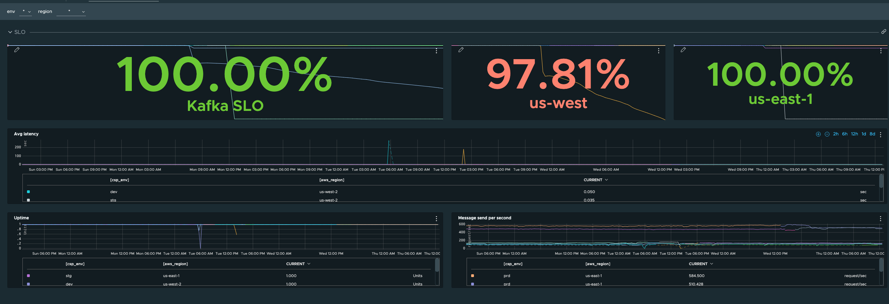
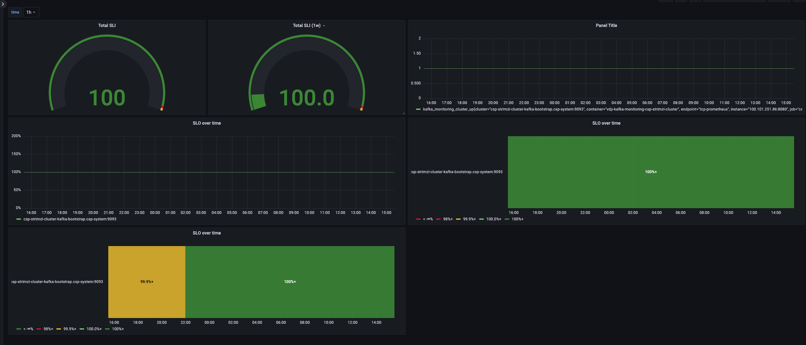

# service-level-indicator-exporter-for-kafka

## Overview
Kafka monitoring is a service written in golang who will help you to monitoring and calculate your SLO over your kafka cluster. The service will start a kafka producer who sends fake data to your kafka cluster, collecting the result in different prometheus metrics. Using this metrics you can create different alerts or dashboards.

## Getting Started
### Start the kafka environ
The repo provide a makefile with some useful instruccion. You can start a kafka cluster with zookeeper using the docker-compose file in this project. This will deploy a simple local cluster in which you can test your service.
```bash
    make start-environ
```
### Run kafka monitoring instance
Once you have the kafka cluster up and running you can start your kafka-monitoring instance and take a look on the metrics.
```bash
    make run-producer
```
Nevertheless, you can build the service and run the binary. Next command will generate a binary in `bin/vdp-kafka-monitoring` who you can run locally.
```bash
    make run-binary
```

## Prometheus Metrics Overview

|  Value | Type | Labels | Description |
| -------- | ------ | -------- | -------- |
| kafka_monitoring_cluster_up | Gauge | Cluster | Kafka cluster with error connection. 1 if cluster is up, 0 if cluster is down |
| kafka_monitoring_total_messages_send | Counter | Cluster, Topic | Total messages send by the kafka monitoring services |
| kafka_monitoring_total_messages_read | Counter | Cluster, Topic | Total messages read by the kafka monitoring services |
| kafka_monitoring_error_total_messages_send | Counter | Cluster, Topic | Total messages with errors send by the kafka monitoring services |
| kafka_monitoring_message_send_duration | Summary | Cluster, Topic | Latency for kafka producer message send |

## Example dashboards

We provide couple of dashboard as an example for the main monitoring system like grafana or wavefront.

Inside the resources folder you will find an [grafana example dashboard](resources/grafana-dashboard.json).







## Contributing

The service-level-indicator-exporter-for-kafka project team welcomes contributions from the community. Before you start working with service-level-indicator-exporter-for-kafka, please
read our [Developer Certificate of Origin](https://cla.vmware.com/dco). All contributions to this repository must be
signed as described on that page. Your signature certifies that you wrote the patch or have the right to pass it on
as an open-source patch. For more detailed information, refer to [CONTRIBUTING.md](CONTRIBUTING.md).

## License

Redistribution and use in source and binary forms, with or without modification, are permitted provided that the following conditions are met:
1. Redistributions of source code must retain the above copyright notice, this list of conditions and the following disclaimer.

2. Redistributions in binary form must reproduce the above copyright notice, this list of conditions and the following disclaimer in the documentation and/or other materials provided with the distribution.

THIS SOFTWARE IS PROVIDED BY THE COPYRIGHT HOLDERS AND CONTRIBUTORS "AS IS" AND ANY EXPRESS OR IMPLIED WARRANTIES, INCLUDING, BUT NOT LIMITED TO, THE IMPLIED WARRANTIES OF MERCHANTABILITY AND FITNESS FOR A PARTICULAR PURPOSE ARE DISCLAIMED.  IN NO EVENT SHALL THE COPYRIGHT HOLDER OR CONTRIBUTORS BE LIABLE FOR ANY DIRECT, INDIRECT, INCIDENTAL, SPECIAL, EXEMPLARY, OR CONSEQUENTIAL DAMAGES (INCLUDING, BUT NOT LIMITED TO, PROCUREMENT OF SUBSTITUTE GOODS OR SERVICES; LOSS OF USE, DATA, OR PROFITS; OR BUSINESS INTERRUPTION) HOWEVER CAUSED AND ON ANY THEORY OF LIABILITY, WHETHER IN CONTRACT, STRICT LIABILITY, OR TORT (INCLUDING NEGLIGENCE OR OTHERWISE) ARISING IN ANY WAY OUT OF THE USE OF THIS SOFTWARE, EVEN IF ADVISED OF THE POSSIBILITY OF SUCH DAMAGE.